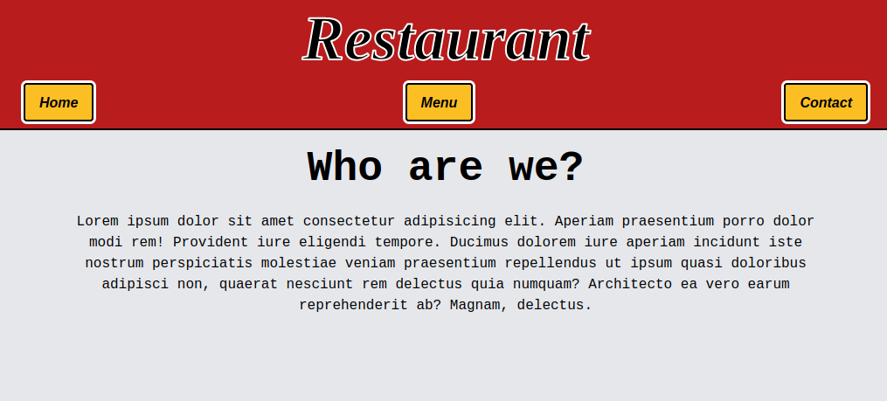
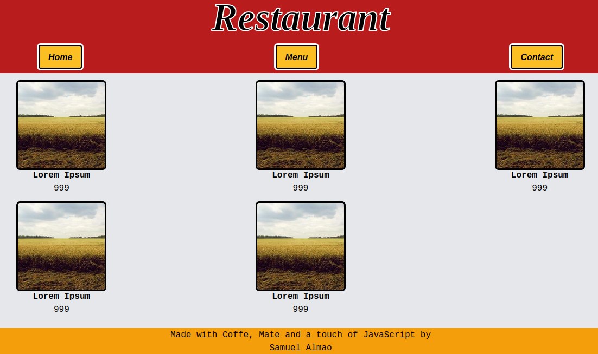

Restaurant page built with ES6 modules, using webpack.

## Desktop




## Built With

- HTML,
- CSS,git
- VS Code
- JavaScript
- Tailwind.css
- Webpack

## Live Demo

<a href= "https://raw.githack.com/SigmaSam/Restaurant-Page/features/dist/index.html" target="_blank">Live version</a>

## Getting Started

To get a local copy up and running follow these simple example steps.

### Setup

```
npm install
```

### Usage

```
npm start
```

## Author

Feel free to reach out. I'm always happy to connect :slightly_smiling_face:

👤 **Samuel Almao**


[<code></code>](https://github.com/SigmaSam)
[<code></code>](https://twitter.com/DungeonSam)
[<code></code>](https://www.linkedin.com/in/samuel-almao/)
[<code></code>](mailto:samuelalmaoherrera@gmail.com)